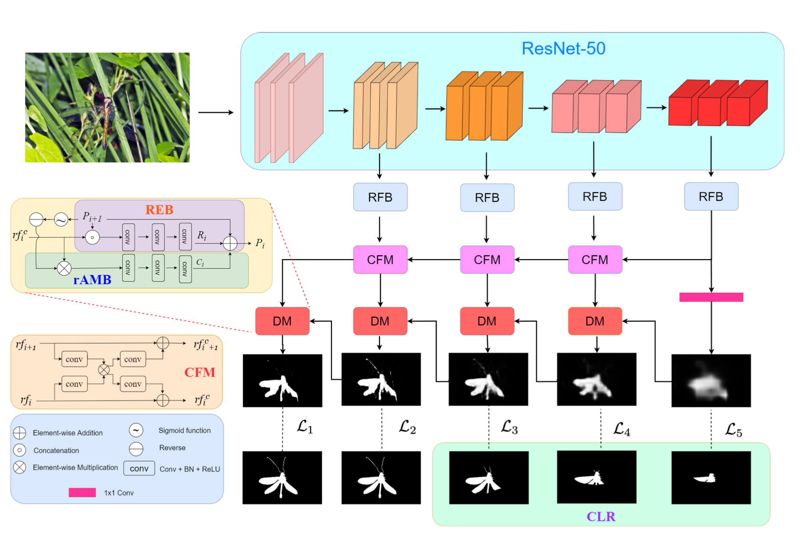

# (ICME 2022) Finding the Achilles Heel: Progressive Identification Network for Camouflaged Object Detection

## Model Architecture



## Prerequisites

- Install Enviroment

```python
    conda create -n PINet python=3.7
    conda install pytorch==1.8.0 torchvision==0.9.0 torchaudio==0.8.0 cudatoolkit=11.1 -c pytorch -c conda-forge
    pip install tensorboardX
    pip install opencv-python
```

- Install Apex

```python
    git clone https://github.com/NVIDIA/apex.git
    cd apex
    python setup.py install --cpp_ext
```

## Datasets

- Training data from [Google Drive](https://drive.google.com/drive/folders/1SsRdMheybUO65RL9eROt9nC08ua0suQ3?usp=sharing)
- Testing data from [Google Drive](https://drive.google.com/drive/folders/1_AKpiW8NRAjgdCpWSL6YhgzRVL1-1P7S?usp=sharing)

## Pretrained models

You can download our pretrained model from [Google Drive](https://drive.google.com/drive/folders/1w4reynES2c8tGhoKOIG3jg1Ps_8XpC_p?usp=sharing)

## Usage

For training, use the command:

```python
python train.py
```

For testing, use the command:

```python
python test.py
```

## Results


## Citation

If you find our paper useful in your research, please cite us using the following entry:
