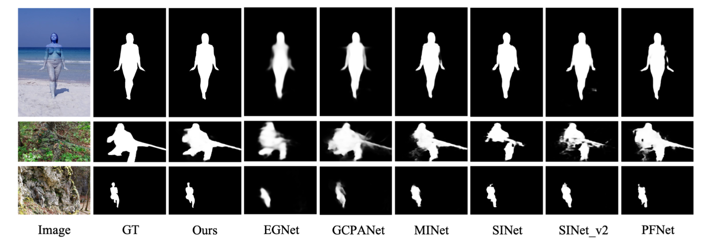

# (ICME 2022) Finding the Achilles Heel: Progressive Identification Network for Camouflaged Object Detection
Paper for our Progressive Identification Network, also called PINet [[PDF](https://basiclab.lab.nycu.edu.tw/assets/COD-ICME.pdf)], published at ICME 2022

## Model Architecture


## Prerequisites

- Install Enviroment

```python
    conda create -n PINet python=3.7
    conda install pytorch==1.8.0 torchvision==0.9.0 torchaudio==0.8.0 cudatoolkit=11.1 -c pytorch -c conda-forge
    pip install tensorboardX
    pip install opencv-python
```

- Install Apex

```python
    git clone https://github.com/NVIDIA/apex.git
    cd apex
    python setup.py install --cpp_ext
```

## Datasets

- Training data from [Google Drive](https://drive.google.com/drive/folders/1SsRdMheybUO65RL9eROt9nC08ua0suQ3?usp=sharing)
- Testing data from [Google Drive](https://drive.google.com/drive/folders/1_AKpiW8NRAjgdCpWSL6YhgzRVL1-1P7S?usp=sharing)

## Pretrained models

You can download our pretrained model from [Google Drive](https://drive.google.com/drive/folders/1w4reynES2c8tGhoKOIG3jg1Ps_8XpC_p?usp=sharing)

## Usage

For training, use the command:

```python
python train.py
```

For testing, use the command:

```python
python test.py
```

## Results



## Citation

If you find our paper useful in your research, please cite us using the following entry:
```
@INPROCEEDINGS{9859854,
  author={Chou, Mu-Chun and Chen, Hung-Jen and Shuai, Hong-Han},
  booktitle={2022 IEEE International Conference on Multimedia and Expo (ICME)}, 
  title={Finding the Achilles Heel: Progressive Identification Network for Camouflaged Object Detection}, 
  year={2022},
  volume={},
  number={},
  pages={1-6},
  doi={10.1109/ICME52920.2022.9859854}}
```
